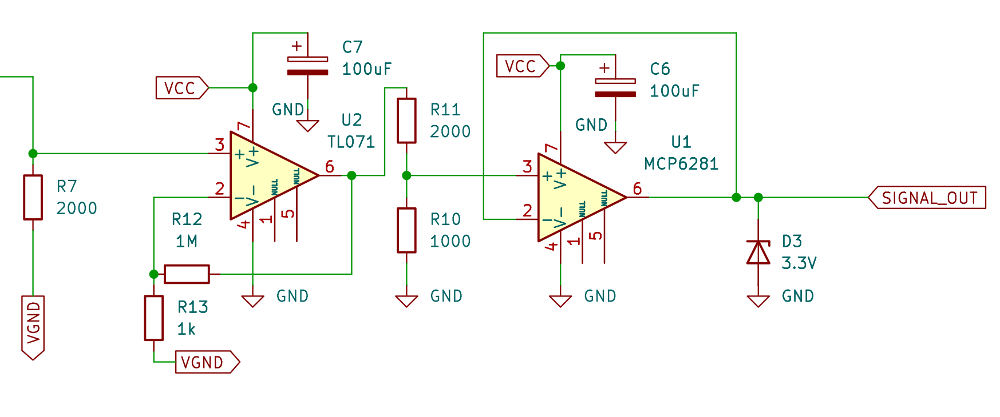
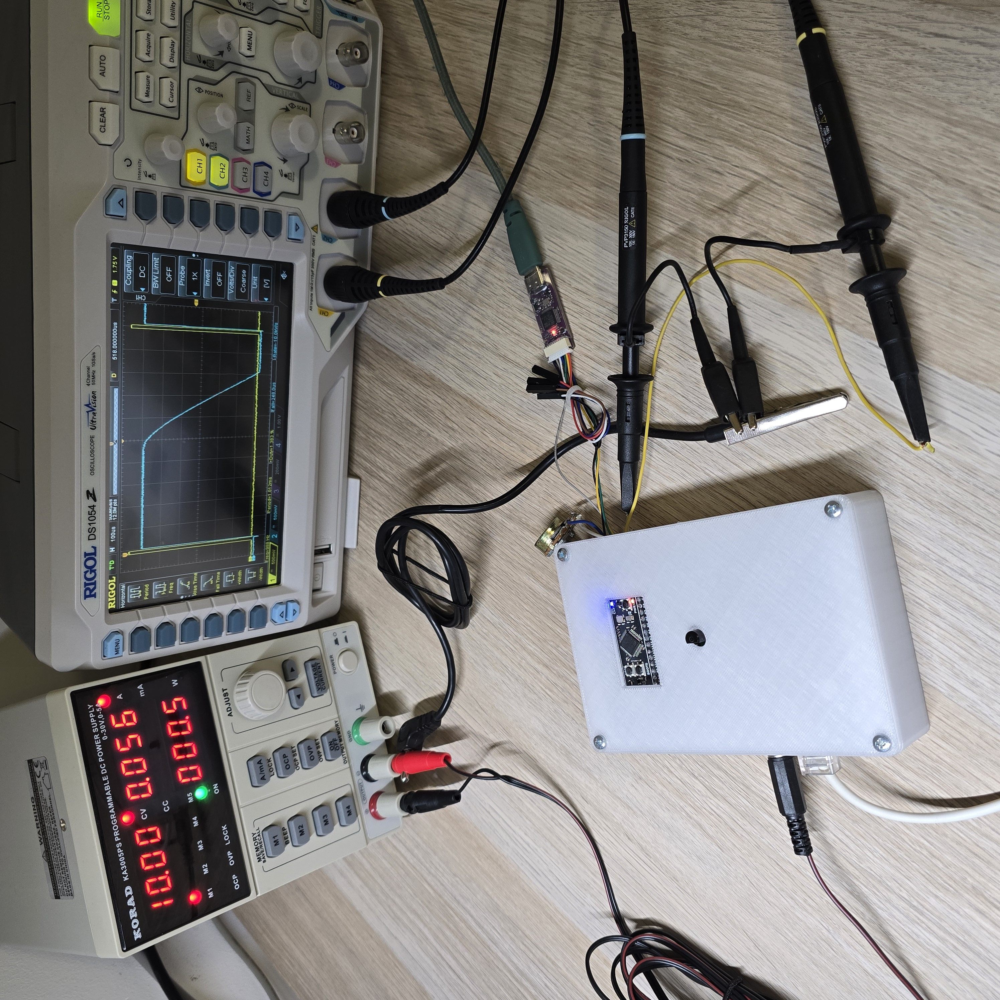

# GitKop - engineering thesis

This is a repository containing my engineering thesis document, hardware and software project with simulations.

The heart of the device is a STM32H523CE microcontroller, with custom-made PCB.

**You can read the thesis** [here](https://PawelReich.github.io/GitKop). It is written in Polish. 

## Abstract

The subject of this thesis is the design and implementation of a metal detector prototype operating
in Pulse Induction technology. The theoretical part contains a historical outline of the development
of detection methods, starting from discoveries in the 19th century and ending with modern
solutions. An analysis of physical phenomena, such as Faraday’s law of induction or eddy currents,
which constitute the foundation of the device’s operation, was performed. A review of existing
popular metal detector architectures and coil types was also conducted, justifying the choice of
technology. In the practical part, the process of building a prototype based on the STM32H523CE
microcontroller with an ARM Cortex M-33 core is described in detail. The operation of the created
software implementing real-time data acquisition and signal anomaly detection through the analysis
of response time and decay slope is explained. The project assumes the creation of a functional
mobile device, along with a manufactured printed circuit board and a probe enclosed in a designed
housing made using 3D printing technology

The software is currently written in baremetal C with HAL. Accompanying software is written in Python with tkinter.

# Wykrywacz metalu - Paweł Reich 2025

## Zadania do wykonania:	
* Analiza zasad działania wykrywaczy metalu (indukcja elektromagnetyczna, impulsowe systemy detekcji).
* Opracowanie układu elektronicznego odpowiedzialnego za generowanie pola magnetycznego i odbiór sygnałów zwrotnych.
* Implementacja algorytmu analizy sygnałów detekcyjnych (np. filtrowanie szumów, identyfikacja rodzaju metalu).
* Projekt i wykonanie prototypu urządzenia, w tym obudowy oraz sondy detekcyjnej.
* Testy działania wykrywacza w różnych środowiskach oraz analiza jego skuteczności.

## Literatura:	
* "Metal Detector Studies: Research Materials", James Baker-Jarvis
* "Electromagnetics Explained: A Handbook for Wireless/RF, EMC, and High-Speed Electronics", Ron Schmitt
* Dokumentacja techniczna czujników elektromagnetycznych i mikroprocesorów użytych w projekcie (np. Arduino, ESP32).
